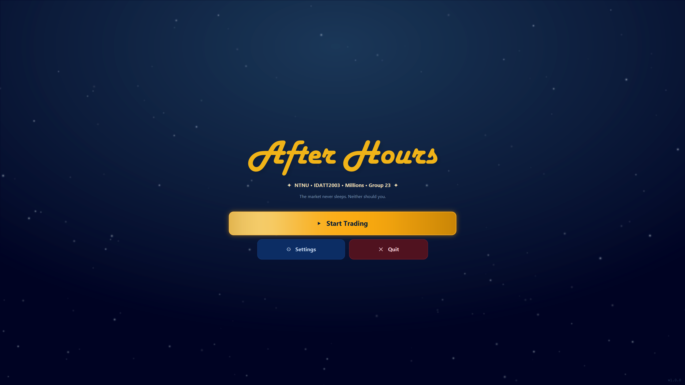
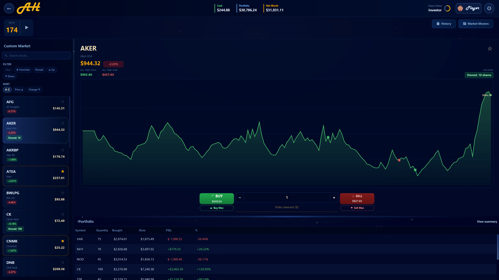
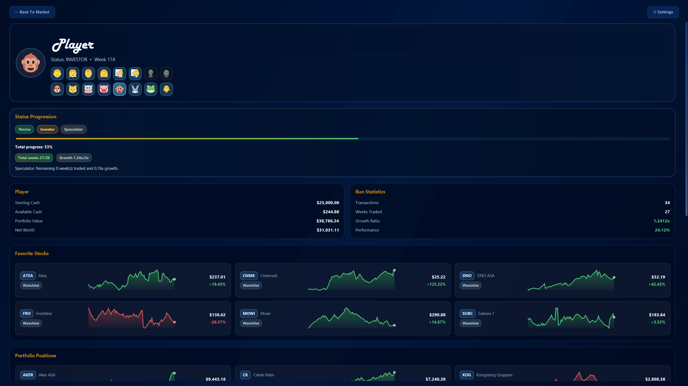

<p align="center">
	
</p>

<p align="center">
	<strong>A desktop stock-trading simulation game built with Java and JavaFX.</strong>
</p>

<p align="center">
	<a href="https://github.com/JoachimVN/After-Hours/releases">Releases</a>
	|
	<a href="https://github.com/JoachimVN/After-Hours/wiki">Wiki</a>
	|
	<a href="https://github.com/JoachimVN/After-Hours/issues">Issues</a>
	|
	<a href="https://github.com/JoachimVN/After-Hours/pulls">Pull Requests</a>
	|
	<a href="https://github.com/JoachimVN/After-Hours/milestones">Milestones</a>
	|
	<a href="https://github.com/JoachimVN/After-Hours/commits/main">Commits</a>
</p>

After Hours is a desktop stock-trading simulation game built with Java and JavaFX.
You start with a fixed amount of cash, trade through weekly market updates, and try to grow your net worth while managing risk.

## Project Links

- Repository: https://github.com/JoachimVN/After-Hours
- Releases: https://github.com/JoachimVN/After-Hours/releases
- Wiki: https://github.com/JoachimVN/After-Hours/wiki
- Issues: https://github.com/JoachimVN/After-Hours/issues
- Pull Requests: https://github.com/JoachimVN/After-Hours/pulls
- Milestones: https://github.com/JoachimVN/After-Hours/milestones
- Soundtrack: https://soundcloud.com/joavn/sets/after-hours

## Screenshots
<p align="center">
	
	<em>Landing Page</em>
	<br>
	<br>
	
	<em>In-game Page example</em>
	<br>
	<br>
	
	<em>Profile page example</em>
	<br>
	<br>
</p>

## Why This Project

The project was developed as part of IDATT2003 at NTNU and focuses on:

- object-oriented domain modeling
- JavaFX UI architecture and navigation
- robust persistence (save/load)
- testability and maintainability

## Core Features

- Interactive market simulation with weekly progression
- Buy/sell flows with transaction tracking
- Profile dashboard with mini trend charts for favorites and holdings
- Save management (manual saves + autosave support)
- CSV import/export tooling for stock data
- In-app settings for audio, visuals, and performance behavior
- Cross-platform packaging support (Windows, Linux, macOS)

## Tech Stack

- Java 25
- JavaFX 25
- Maven
- JUnit 6
- Gson

## Tools Used

- Visual Studio Code
- IntelliJ
- Git
- GitHub
- Figma
- PowerPoint
- Photopea
- Soundation

## Getting Started

### Prerequisites

- JDK 25 installed and available on PATH
- Maven 3.9+ installed

### Run the App (development)

```bash
mvn javafx:run
```

### Run Tests

```bash
mvn test
```

Generate coverage report:

```bash
mvn verify
```

## Build and Distribution

Create package artifacts:

```bash
mvn package -Pportable-jar
```

This produces:

- fat runnable jar: target/after-hours-version-with-dependencies.jar

### Native Packaging (jpackage)

After mvn package:

```bash
# Windows EXE
mvn exec:exec@jpackage

# Linux app-image
mvn exec:exec@jpackage-linux

# macOS app-image
mvn exec:exec@jpackage-mac
```

## Project Structure

```text
src/main/java/edu/ntnu/idatt2003/g23
	App.java                 # application entry + navigation orchestration
	model/                   # core domain model (player, stocks, transactions)
	io/                      # persistence, import/export, save/load logic
	ui/                      # shared UI infrastructure
	ui/views/                # view modules (landing, game, profile, settings, etc.)
	session/                 # game session lifecycle support
	audio/                   # music and SFX controllers

src/main/resources
	css/                     # UI styling
	images/                  # logos and visual assets
	data/                    # bundled stock/game data
	scripts/                 # distribution launch scripts
```

## Team Members

[Håvard Slettevoll Ellingsen](https://github.com/JoachimVN/After-Hours/wiki/Håvard-Slettevoll-Ellingsen)

[Joachim Valdersnes Nilsen](https://github.com/JoachimVN/After-Hours/wiki/Joachim-Valdersnes-Nilsen)

Group 23, IDATT2003.
